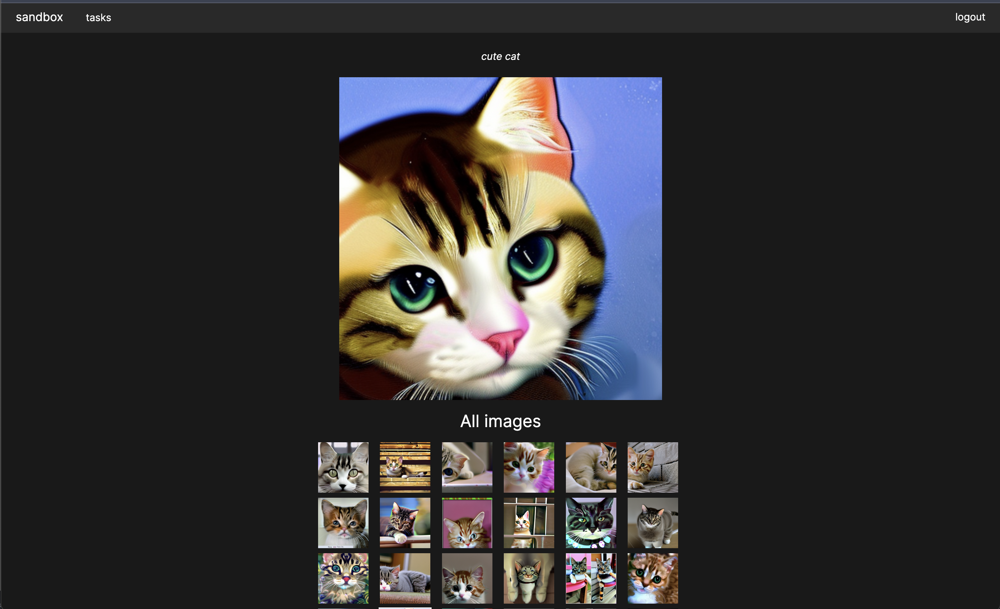

sandbox: web app for exploring generative ai models

---

This web app is built for learning and fun purposes. All components are written in Rust.

# Usage

- publicly available instance at [sandbox.nikitavbv.com](https://sandbox.nikitavbv.com)
- self hosted

# Features

- Generate images with Stable Diffusion v2.1

# TODOs

- add "about" page.
- generate images using controlnet.
- serve static frontend files from sandbox-server, so that you can run most of the app (without worker) with single `cargo run`.
- enable caching for assets.
- make "tasks" link in the header to be an actual link.
- delete images and tasks.

# Acknowledgments

Most of the heavy lifting is performed by these amazing libraries:
- [tch-rs](https://github.com/LaurentMazare/tch-rs)
- [diffusers-rs](https://github.com/LaurentMazare/diffusers-rs)