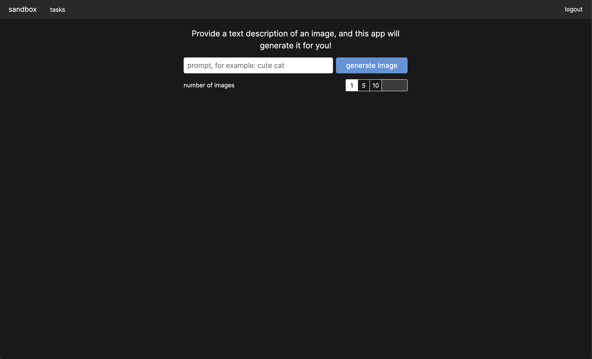

this is a sandbox to play with various ml models for learning and fun.

# todos

- serve static frontend files from sandbox-server, so that you can run most of the app (without worker) with single `cargo run`.
- enable caching for assets
